# Animation Gallery

<!-- This page is automatically generated. Do not edit manually. -->

Welcome to the `ez-animate` gallery! Our animations are compatible with both Scikit-learn and `sega_learn` models. Browse the examples below to see what you can create.

---

## Scikit-learn Examples

<ul class="grid cards columns-2" markdown>
  <li>
    <a href="../gallery_examples/sklearn_classification_gradientBoostingClassifier/" class="card">
      

        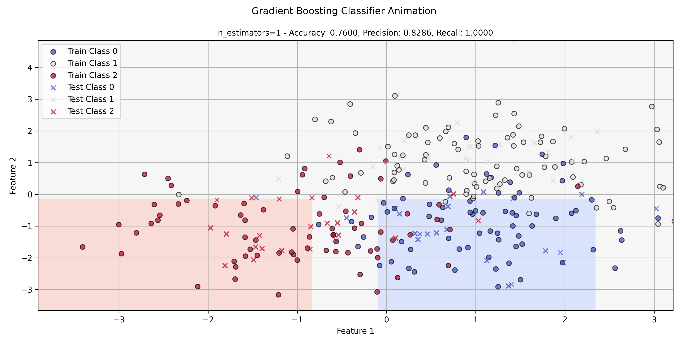
      

      

        
<strong>Classification Gradient Boosting Classifier</strong>

      

    </a>
  </li>
  <li>
    <a href="../gallery_examples/sklearn_classification_sgd/" class="card">
      

        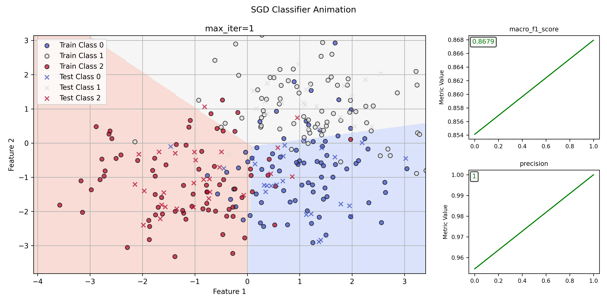
      

      

        
<strong>Classification SGD</strong>

      

    </a>
  </li>
  <li>
    <a href="../gallery_examples/sklearn_clustering_kmeans/" class="card">
      

        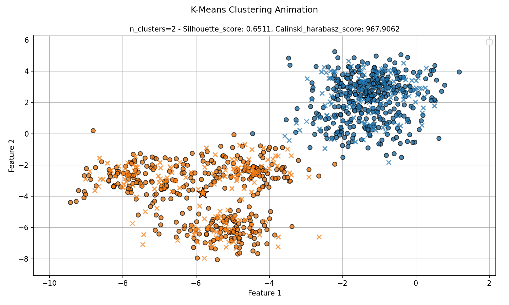
      

      

        
<strong>Clustering Kmeans</strong>

      

    </a>
  </li>
  <li>
    <a href="../gallery_examples/sklearn_clustering_kmeans_traced/" class="card">
      

        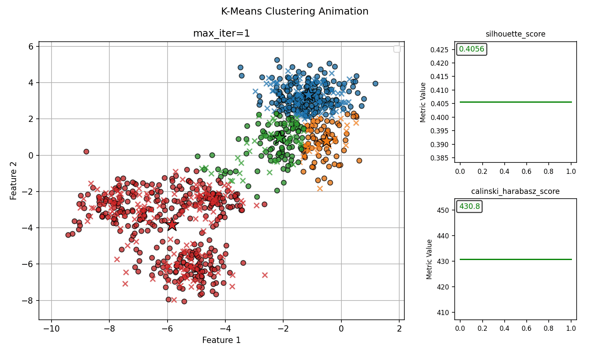
      

      

        
<strong>Clustering Kmeans Traced</strong>

      

    </a>
  </li>
  <li>
    <a href="../gallery_examples/sklearn_forecast_quantileRegressor/" class="card">
      

        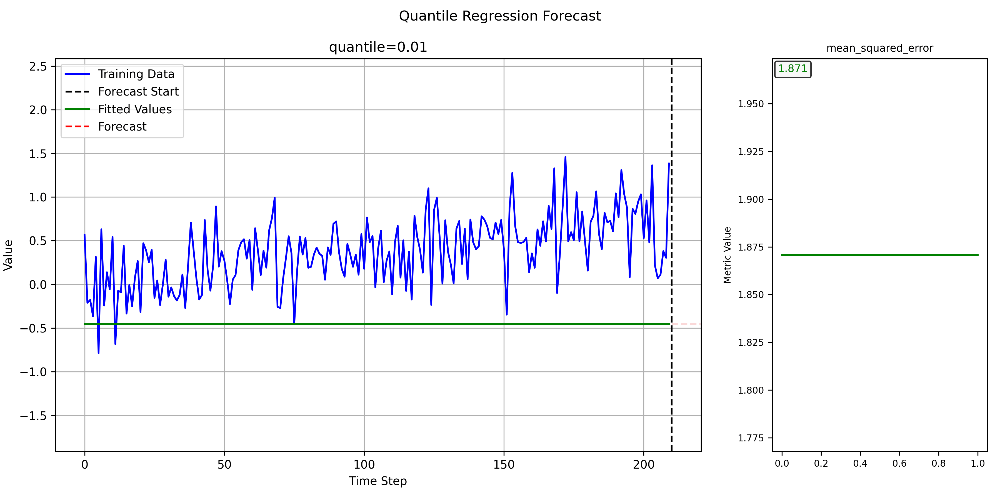
      

      

        
<strong>Forecast Quantile Regressor</strong>

      

    </a>
  </li>
  <li>
    <a href="../gallery_examples/sklearn_regression_lasso/" class="card">
      

        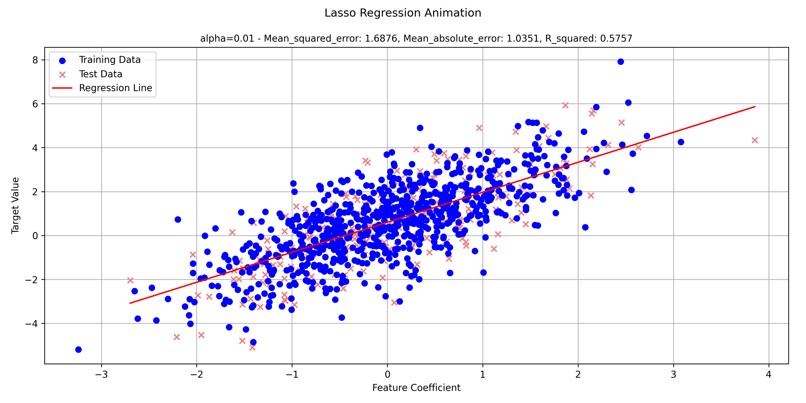
      

      

        
<strong>Regression Lasso</strong>

      

    </a>
  </li>
  <li>
    <a href="../gallery_examples/sklearn_regression_sgd/" class="card">
      

        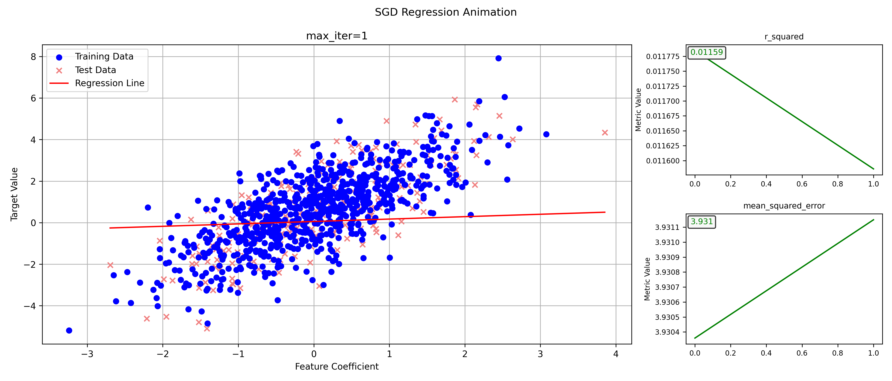
      

      

        
<strong>Regression SGD</strong>

      

    </a>
  </li>
</ul>

## Sega-learn Examples

<ul class="grid cards columns-2" markdown>
  <li>
    <a href="../gallery_examples/sega_learn_classification_logisticRegression/" class="card">
      

        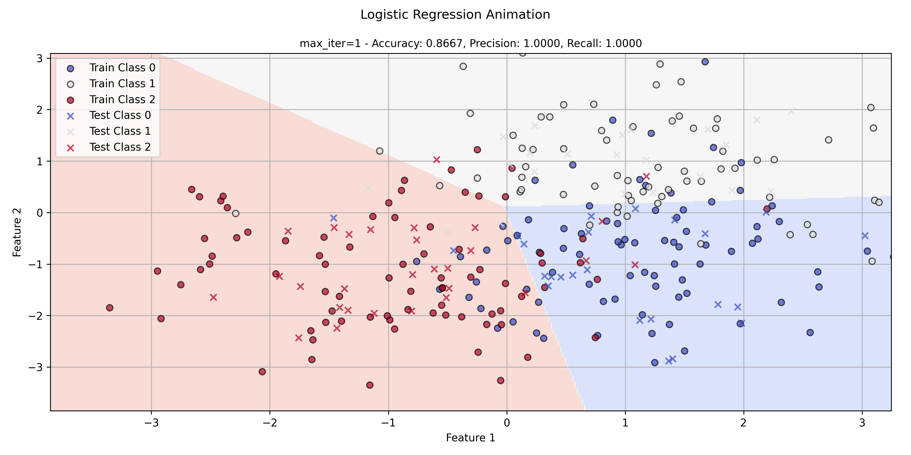
      

      

        
<strong>Classification Logistic Regression</strong>

      

    </a>
  </li>
  <li>
    <a href="../gallery_examples/sega_learn_classification_perceptron/" class="card">
      

        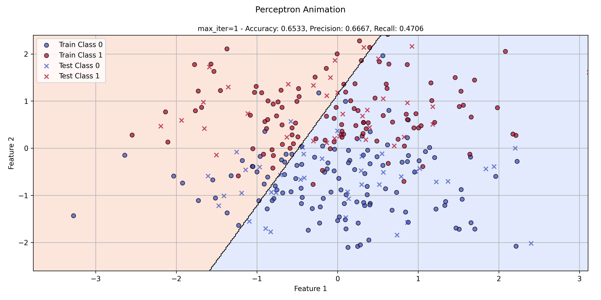
      

      

        
<strong>Classification Perceptron</strong>

      

    </a>
  </li>
  <li>
    <a href="../gallery_examples/sega_learn_clustering_dbscan/" class="card">
      

        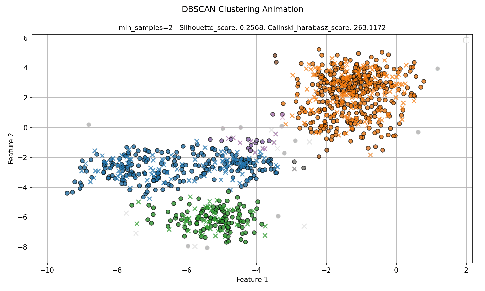
      

      

        
<strong>Clustering DBSCAN</strong>

      

    </a>
  </li>
  <li>
    <a href="../gallery_examples/sega_learn_forecast_exponentialMovingAverage/" class="card">
      

        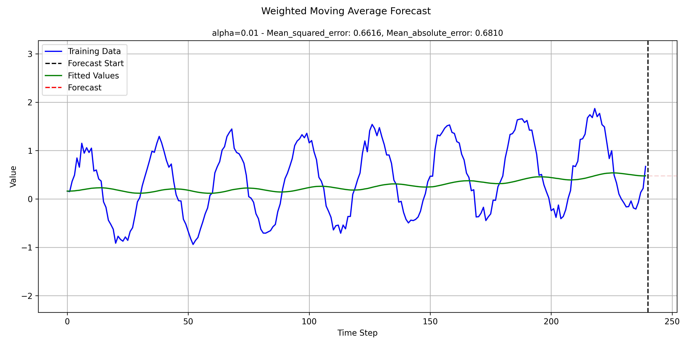
      

      

        
<strong>Forecast Exponential Moving Average</strong>

      

    </a>
  </li>
  <li>
    <a href="../gallery_examples/sega_learn_forecast_ransac/" class="card">
      

        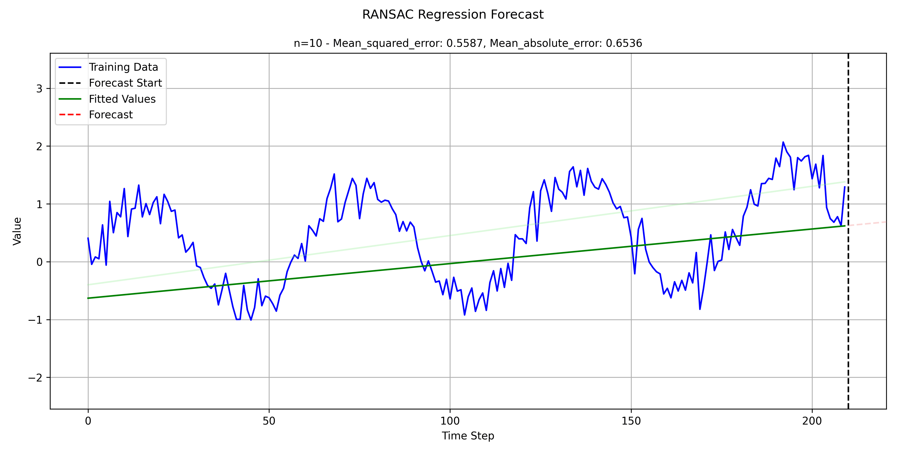
      

      

        
<strong>Forecast RANSAC</strong>

      

    </a>
  </li>
  <li>
    <a href="../gallery_examples/sega_learn_forecast_ridge/" class="card">
      

        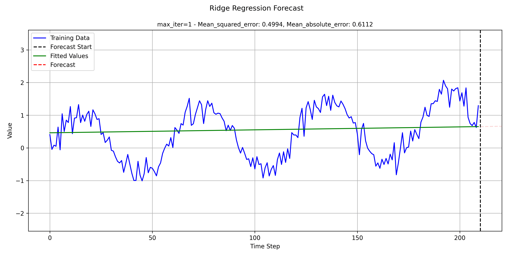
      

      

        
<strong>Forecast Ridge</strong>

      

    </a>
  </li>
  <li>
    <a href="../gallery_examples/sega_learn_forecast_weightedMovingAverage/" class="card">
      

        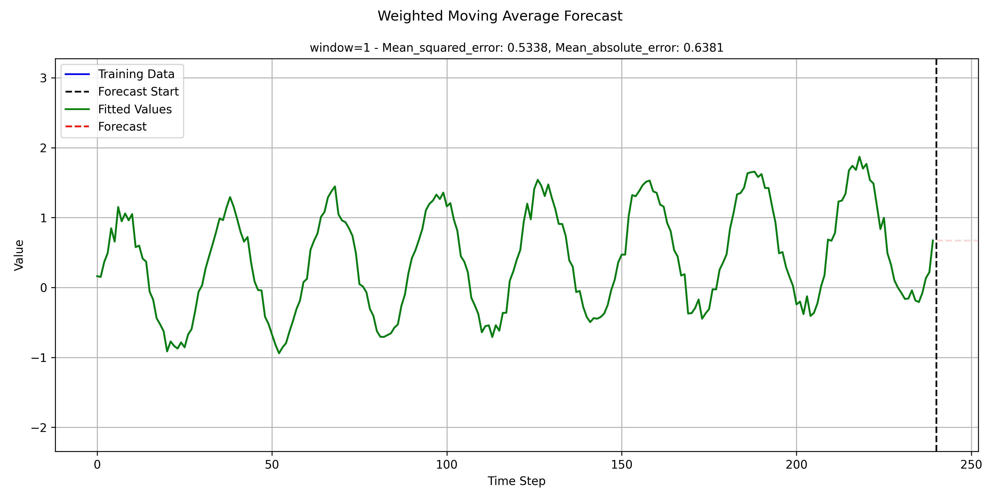
      

      

        
<strong>Forecast Weighted Moving Average</strong>

      

    </a>
  </li>
  <li>
    <a href="../gallery_examples/sega_learn_regression_ridge/" class="card">
      

        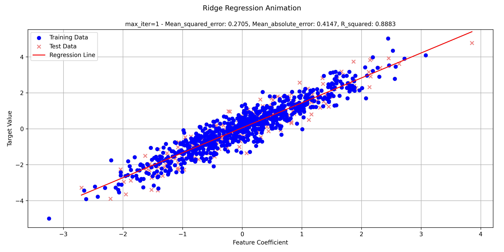
      

      

        
<strong>Regression Ridge</strong>

      

    </a>
  </li>
</ul>
